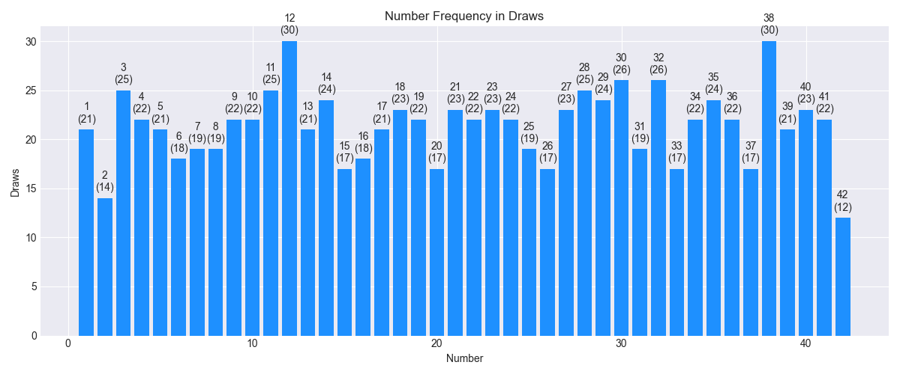
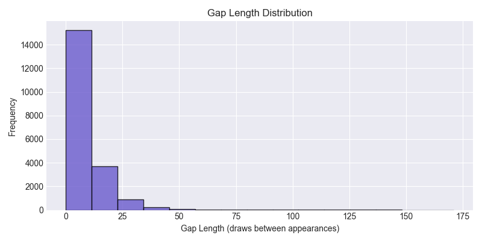

# Hit 5 Lottery Analysis

### **Project Overview**
This repository implements a modular data analytics pipeline for cleaning, analyzing, and visually communicating patterns in 5-number lottery draws. The primary goal is to help players make informed, data-driven choices by revealing trends, randomness, and statistical significance in historical Hit 5 draw data.

### **Scope of Project**
 **Included:**
* Cleaning and preparing raw Hit 5 draw data

* Frequency analysis to identify "hot", "warm", and "cold" numbers

* Gap analysis to visualize intervals between appearances for each number

* Statistical tests (chi-square, runs test, autocorrelation) to evaluate randomness and fairness

* Generation of clear visualizations: bar charts, boxplots, heatmaps, and histograms

* Summarizing findings and supporting responsible player-focused decision making

* **Not Included:**

* Predictive modeling to forecast future draws or guarantee wins

* Manipulation or analysis of lottery systems beyond official, public draw data

* Automation of gambling or integration with betting systems


### **Data Source and Attribution**
The historical lottery data analyzed in this project originates from:

Washington's Lottery - Official Results
https://www.walottery.com/WinningNumbers/

### **Methodology**
This project follows the CRISP-DM methodology:

* Business Understanding: Define the player's goals and questions

* Data Understanding: Collect and explore Hit 5 draw data

* Data Preparation: Clean, deduplicate, and format numbers and dates

* Modeling & Analysis: Apply frequency, gap, and randomness analysis

* Evaluation: Interpret charts and statistical results with player decision-making in mind

* Deployment: Summarize findings and document reproducible analytics steps

Analytical Methods and Statistical Significance
* Frequency & Gap Analysis: Quantify frequency and gap lengths for each number using bar charts and boxplots

* Chi-square Goodness-of-Fit: Tests whether observed number frequencies deviate from expected randomness (
χ2 statistic, p-value, α=0.05)

* Runs Test for Randomness: Checks for clustering or streaks in draws (Z-statistic, p-value, α=0.05)

* Autocorrelation: Measures serial dependence between draws (coefficient, p-value)

These statistical tools and metrics were chosen for their validity in assessing randomness and fairness—crucial for player insight.

### **Methods of Extraction and Processing**
**Raw Data Collection:** Draw results were manually downloaded and/or programmatically extracted from Washington's Lottery official winning numbers pages, using standard web browsers and custom Python scripts (see html2hit5.py for examples).

**Cleaning & Preprocessing:** All draw records were reformatted, deduplicated, and cleaned to normalize date formats and number columns using scripts in the scripts/ and utils/ folders.

**Data Files:** Intermediate and results data (e.g., data/hit5_clean_deduped.csv) are derived solely from the aforementioned public lottery data.

Intellectual Property and Open Source Notice
This repository is an open-source, non-commercial project for educational, statistical, and research purposes only.
Washington's Lottery retains all copyrights and ownership of the original draw result data.
Use, redistribution, or publication of the data should comply with the terms outlined by the Washington State Lottery and any additional applicable regulations.

**No affiliation or endorsement:** This project is not affiliated with, endorsed by, or associated with Washington's Lottery, the Washington State Lottery Commission, or any related entity.
Official game results should always be verified via the primary source.

If utilizing or redistributing this dataset, please cite both this repository and the official Washington Lottery site as the original source for the underlying game results.


### **Visual Communication**
* Bar Chart: Number frequency (identifies hot/cold numbers)

* Boxplot: Gap lengths by number (reveals outliers and streaks)

* Heatmap: Standardized residuals from chi-square analysis (shows statistical deviation)

* Histogram: Overall gap length distribution

* Sum Trend Plot: Rolling mean of draw sums, checks for cycles or anomalies


### **Benefits and Decision-Making Support**
The solution empowers players to:

* Select numbers based on empirical trends rather than guesswork

* Understand risk and the reality of lottery randomness

* Use statistical evidence to inform or refine play strategies

### **Folder Structure**
```
project_root/
│
├── data/       # Raw, cleaned, and output data files
├── scripts/    # Python scripts for processing, analysis, simulation, and backtest
├── notebooks/  # Jupyter notebooks for exploration and reporting
├── archive/    # Deprecated scripts for reference
├── utils/      # Shared utilities (lottery_stats, pool_select, combo_filters, etc.)
├── README.md   # This project overview
```

### **Workflow Chart**
```
flowchart TD
    A[Raw Data (.txt/.html/.csv)] --> B[Cleaning Scripts (clean_data.py, robust_clean.py, dedup.py)]
    B --> C[Cleaned Data (.csv)]
    C --> D[Analysis & Pool/Combo Gen (analysis.py, pool.py, combos.py)]
    D --> E[Simulation/Backtest (backtest_pool.py, backtest.py, hybrid_backtest.py)]
    D --> F[Exploration/Reporting (notebooks)]
    E --> F
```


### **Key Scripts**
* scripts/pool.py, combos.py, backtest_pool.py: Strategic pool generation & historical coverage analysis
* scripts/backtest.py: ML modeling and feature analysis for prediction
* scripts/hybrid_backtest.py: Combines pool selection and ML probabilities to build/test hybrid strategies


### **Requirements**
 1. Python 3.x
 2. pandas, numpy, scikit-learn
 3. Optional: Mermaid support in VS Code for flowcharts


### **Set up**
 #### Option 1: Using Conda
conda env create -f environment.yml
conda activate hit5-lottery-env

#### Option 2: Using PIP
python3 -m venv .venv
source .venv/bin/activate
pip install -r requirements.txt


#### **Usage**
1. Clean raw data:
python scripts/clean_data.py data/hit5_raw.txt

2. Generate pools/ combos:
python scripts/combos.py

3. Pool-based backtest:
python scripts/backtest_pool.py

4. Machine learning backtest:
python scripts/backtest.py

5. Hybrid pool + ML backtest:
python scripts/hybrid_backtest.py

6. Explore/visualize results:
Open Jupyter notebooks in notebooks/

### **Open Source and Attribution**
This repository is open-source, non-commercial, and for educational/player research only. All original Hit 5 draw data remain subject to Washington's Lottery terms. No affiliation, sponsorship, or verification is implied. For any redistribution of draw data, cite both this repository and the official site.
